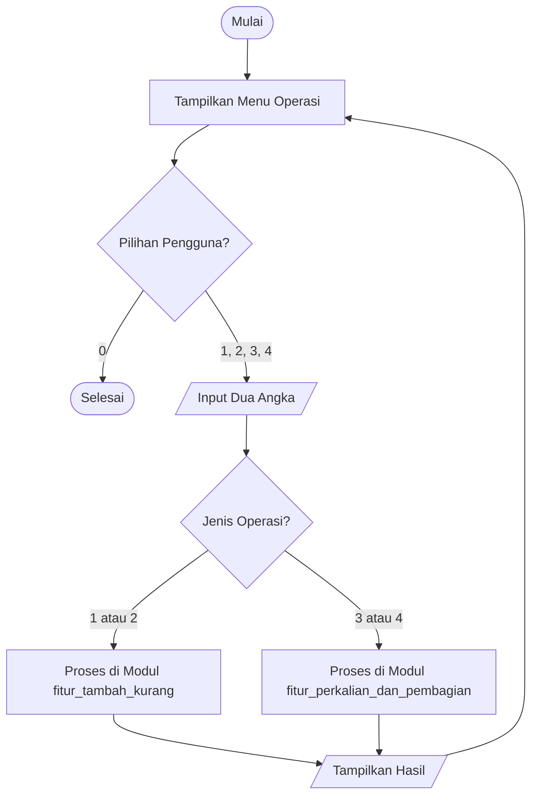

Program kalkulator sederhana menggunakan bahasa python

Pendahuluan: 
Program ini merupakan kalkulator sederhana berbasis Python yang dibuat sebagai tugas kelompok. Program ini dapat melakukan operasi hitung dasar melalui menu di terminal dengan struktur kode yang terpisah agar mudah dipahami.

Fitur Utama Terdiri Atas:
1. Penjumlahan
2. Pengurangan
3. Perkalian
4. Pembagian

Cara menjalankan:
1. Pastikan Python sudah terinstall.
2. Buka Terminal di folder projek.
3. Jalankan: python main.py

Panduan Menjalankan:
1. Buka Terminal / Command Prompt
2. Masuk ke Folder Program
3. Jalankan Program
4. Kalkulator Muncul
5. Masukkan Angka dan Pilih Operasi dan Hasil Perhitungan akan Muncul
6. Tutup Program Setelah Selesai

Dokumentasi Teknis:

    Daftar Kontribusi:

    
| Nama Kontributor        |Nim     | Persentase Kontribusi | Jumlah Kontribusi | Profil GitHub                              |
|------------------------|-----------|----------------------|-------------------|--------------------------------------------|
| Kiran               | 250211060009    |33,33%                  | 10                |  [kiran](https://github.com/kiranamade002-svg.png)  |
| Kevin                 |250211060006  | 33,33%                  | 10                 | [kevin](https://github.com/KevinBryan-afk.png)  |
| Lionel         | 250211060008      | 33,33%                   | 10                 | [lionel](https://github.com/coldfingerlion.png)  |
